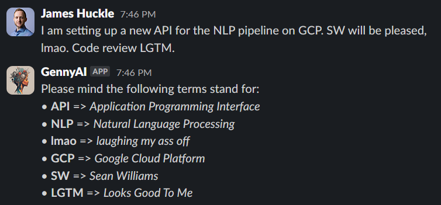
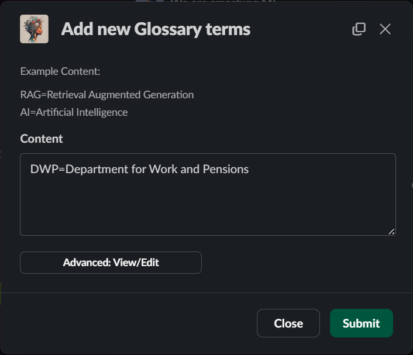
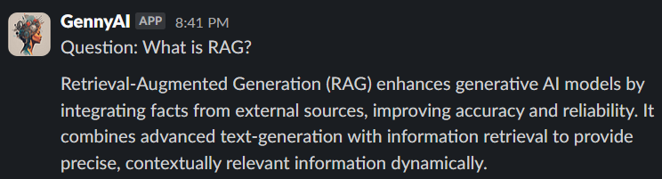
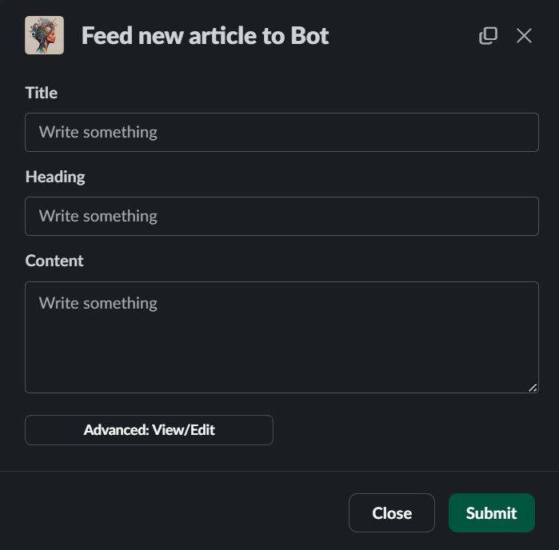
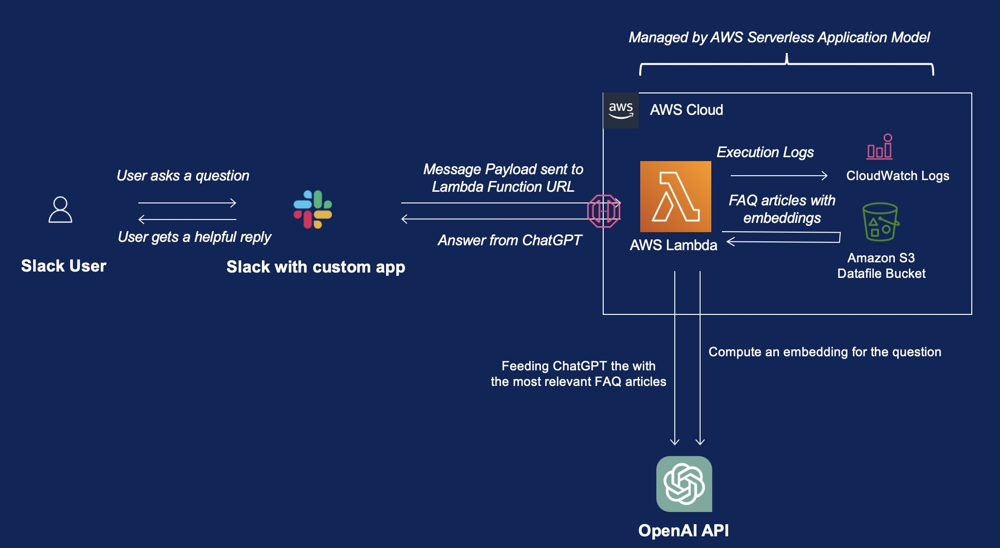
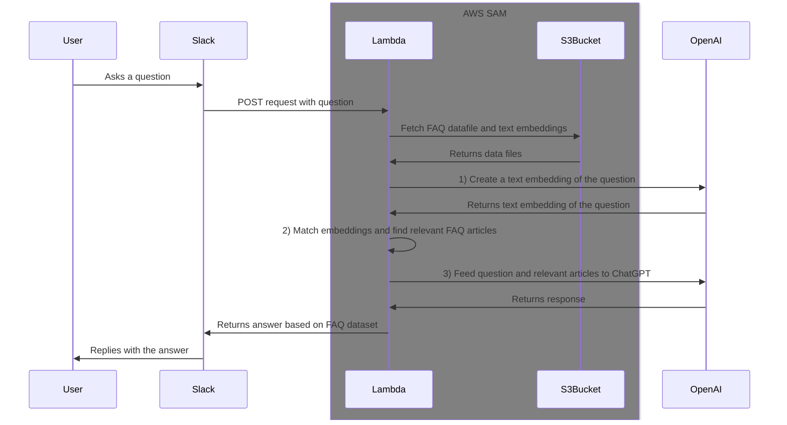
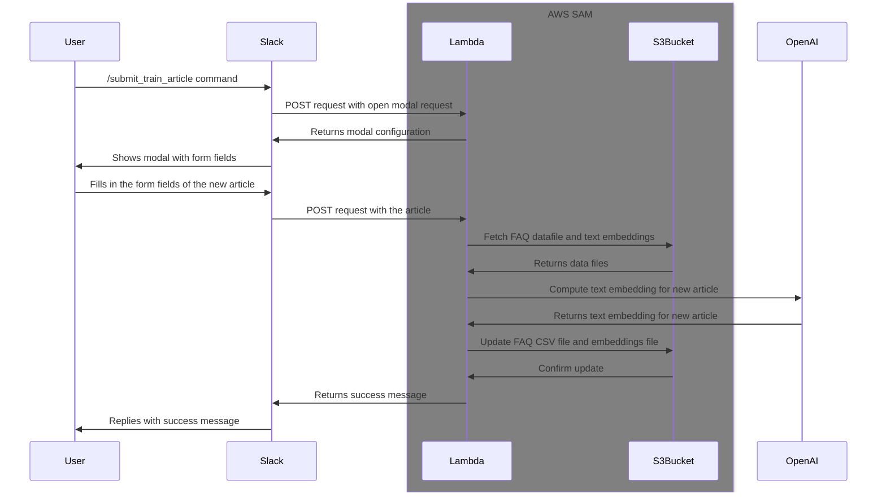
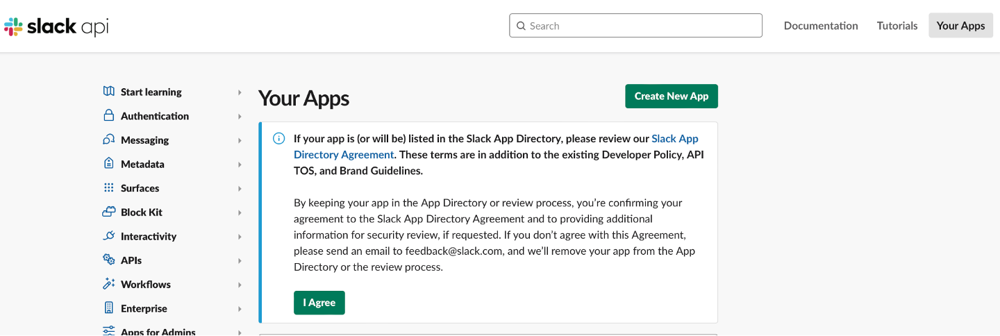
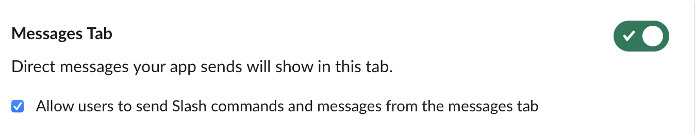

# company-faq-slack-bot


The Slack Bot does two things:

- Acts as a glossary bot, using NLP techniques to match acroymys or buzzwords used in a chat and returns with a fuller description.
- With **/gennai** it can answer questions from a created FAQ database using gpt4-o.

It allows users to submit new articles and glossary terms into it with a [Slash Command](https://slack.com/help/articles/201259356-Slash-commands-in-Slack), so that it can answer with newly added knowledge **immediately**, as it updates the model **on the fly in the cloud**!

## Example Use

#### Glossary Bot

Automatically replies with clarity on any acroymys or buzzwords someone has said in the chat, based on a created glossary.

Use **/gennyai-glossary** in slack to add terms to the glossary. Use adavnced options to view/download/delete terms from csv Database.



#### FAQ answering

Just type in **\gennai What is RAG?** in slack. Use adavnced options to view/download/delete FAQs from csv Database.



Update the knowledge based with short articles with **/gennyai-train**. 



## Architecture and Infrastructure

The infrastructure is built with AWS SAM, and it consists of the following components:

- A Lambda function that handles the Slack API requests, it's possible with the new [Function URL](https://aws.amazon.com/blogs/aws/announcing-aws-lambda-function-urls-built-in-https-endpoints-for-single-function-microservices/) feature that was released in 2022. This saves us from the trouble of setting up an API Gateway.
- A AWS S3 bucket to store the datafiles, that includes a CSV file of the articles, and a CSV file of the document embeddings.

Yeah that's it! With [AWS SAM](https://aws.amazon.com/serverless/sam/), things are simply so simple, and all these are defined in `template.yml`.



Sequence diagram for the Q&A flow:



Sequence diagram for the new training article submission flow:



## Pre-requisites

- Prepare a `.env` file at the root directory, according to the template `.env.example`.
- AWS SAM CLI - [Install the SAM CLI](https://docs.aws.amazon.com/serverless-application-model/latest/developerguide/serverless-sam-cli-install.html)
- Docker - [Install Docker](https://docs.docker.com/get-docker/)
- An OpenAI API Key
  - [Get an OpenAI API Key](https://platform.openai.com/docs/api-reference/authentication) and put it in the `OPENAI_API_KEY` environment variable.
  - Alternatively, you can also get one from Azure if you have access to the [Azure OpenAI Service](https://azure.microsoft.com/en-us/products/cognitive-services/openai-service).
- A Slack App - [Create a Slack App](https://api.slack.com/apps?new_app=1)

### Create a Slack App



The following scopes are required (Configure in the "OAuth & Permissions" page > "Scopes" > "Bot Token Scopes"):

- `chat:write`
- `commands`
- `im:history`
- `im:write`

The following event subscriptions are required:
(but you can't set these yet until the deployment of the AWS SAM infrastructure is done):

- `message.channels`
- `message.groups`
- `message.im`
- `message.mpim`

Enable "Allow users to send commands and messages from the messages tab” in the “App Home” settings.


Lastly, make sure to install the app to your workspace


Prepare the following environment varaibles into the `.env` file

- put the bot OAuth token as `SLACK_BOT_TOKEN`
- the signing secret as `SLACK_SIGNING_SECRET`

## Build and deploy

1. Setup your shell for AWS credentials. There are various ways of doing so, and you may refer to [this documnetation](https://docs.aws.amazon.com/cli/latest/userguide/cli-chap-authentication.html).

   For example, you may run `aws sso login --profile AWSAdministratorAccess-164768572570` if you have configured your AWS credentials with AWS Identity Center (originally named AWS SSO) before.
2. Copy your credentials locally `eval "$(aws configure export-credentials --profile AWSAdministratorAccess-164768572570 --format env)"`
3. Run the `./deploy.sh` script, it will provision everything for you.

After the deployment, you still need to manually upload the initial datafiles.

## Prepare the datafiles

- Prepare a file in `.data/articles.csv`, with three columns `(title, heading, content)`.

  ```bash
  #!/bin/bash
  cd function
  export LOCAL_DATA_PATH=./
  python3 -c 'from embedding import *; prepare_document_embeddings()'
  ```

  Be sure to escape e.g. newline characters into `\n` in the `column` field.

  Then, a file should be created at `./data/document_embeddings.csv`.
- Upload both files onto the S3 bucket that was created by the CloudFormation template, at the following paths:

  `s3://chatgpt-faq-slack-bot-data-autogenai/data/`

  - `s3://$DATAFILE_S3_BUCKET/data/articles.csv`
  - `s3://$DATAFILE_S3_BUCKET/data/document_embeddings.csv`

  If you want to use the command line, you can run the following command:

  ```bash
  aws s3 cp --recursive ./function/data/ s3://$DATAFILE_S3_BUCKET/data/
  ```

That's it!

If you want to be a bit lazy and start with my sample data, just run the following command instead

```bash
aws s3 cp --recursive ./sample_data/ s3://$DATAFILE_S3_BUCKET/data/
```

## Making Everything End-to-End

1. Go to the `Outputs` tab of the deployed CloudFormation template (e.g. `https://us-east-1.console.aws.amazon.com/cloudformation/home?region=us-east-1#/stacks`), copy the URL value of `FunctionUrlEndpoint`.
2. Go back to the config page of your custom Slack App, and paste it at

   "Event Subscriptions" > "Enable Events" > "Request URL" and verify it.
3. Once done, you can go to Slack and try messaging your bot with a question that is supposed to be answerable with the help of your own FAQ dataset!

## Setting up the `/submit_train_article` command

In addition you can also create a `/submit_train_article` slack command so that your users can self-serve submit extra articles into the dataset. The handlers are defined in the following methods of `lambda_function.py`: `handle_submit_train_article_command` and `handle_submit_train_article_submission`.

### Setup

- In your Slack App's config, go to `Features` > `Slack Commands` > `Create New Command`
- After the modal is opened, enter the following details:
  - Command: `/submit_train_article`
  - Request URL: Paste the value of `FunctionUrlEndpoint`
- Then click "Save".

## TODO

- [ ]

## Thanks

This project is based on the following projects:

- [gabrielkoo/chatgpt-faq-slack-bot](https://github.com/gabrielkoo/chatgpt-faq-slack-bot)
- [openai/openai-cookbook - &#34;&#34;Embedding Wikipedia articles for search&#34;&#34;](https://github.com/openai/openai-cookbook/blob/d67c4181abe9dfd871d382930bb778b7014edc66/examples/Embedding_Wikipedia_articles_for_search.ipynb)
- [openai/openai-cookbook - &#34;Question answering using embeddings-based search&#34;](https://github.com/openai/openai-cookbook/blob/main/examples/Question_answering_using_embeddings.ipynb)
- [Slack Bolt Examples - AWS Lambda](https://github.com/slackapi/bolt-python/blob/main/examples/aws_lambda/aws_lambda.py)
- [OpenAI - Introducing text and code embeddings](https://openai.com/blog/introducing-text-and-code-embeddings)
